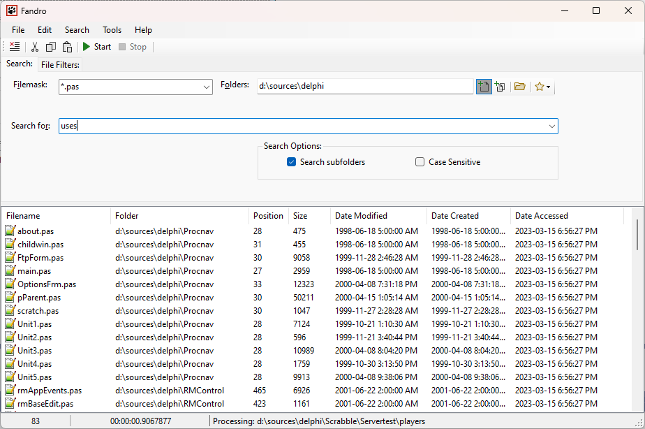
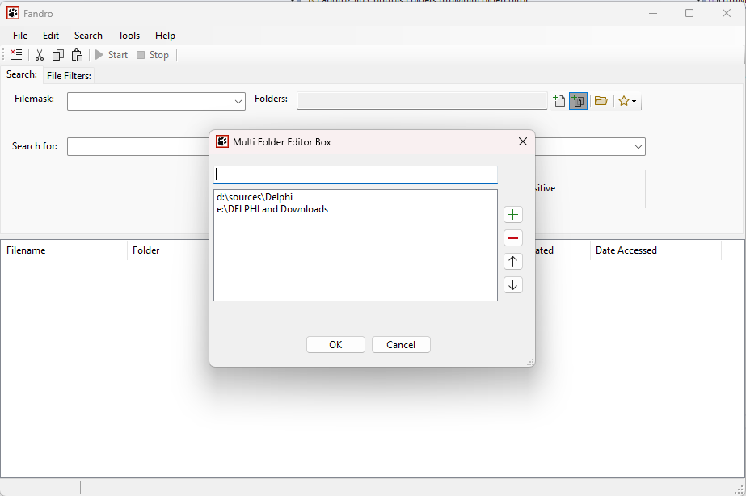
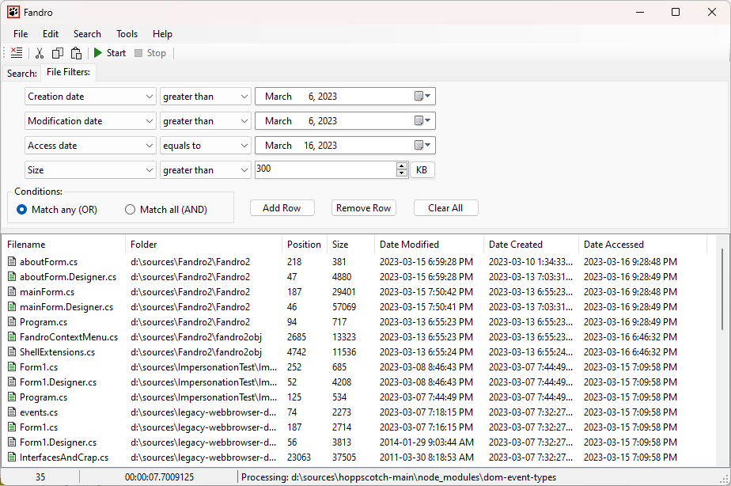

Introduction

Rewrote Fandro in C#. Will search. BMH.

Fandro2 ("nee, Fandro Winforms")

I've been working on this version since 2011 or so - but I finally had time to sort of 'wrap it up'.

Why use it?

No idea. You can search files while also filtering out your files based on specific FileInfo filters? You want to learn some BMH?

Features

* Fast multi-threaded search for text in files with optional FileInfo filters (creation, access, mod date and file size - more coming!)
* New: Multi folder mode - select which folders you want to search thru

Tech features:

* Non recursive file search
* Self-written components for datagrid ("controlgrid"). The .Net datagrid just didn't work for me.
* Removed a lot of windows specific stuff as I plan to refactor out the BMH routines so that I could work on a terminal version

Future

* Separate out BMH routines.
* Fandro.Terminal/CLI 
* Multiplatform (low priority because of the crazy amount of "desktop frameworks" for .Net)

Multiplatform

Fandro is a good test bed to experiment with all these silly UI frameworks available for .Net. Way too many of them - but at least that gives me a chance to see what will work and what not. If you wanted to build an Electron wrapper - feel free to do that in the future after I've separated out the search routines.

Screenshots:

Single folder mode

Multi-folder mode

Filter screen

